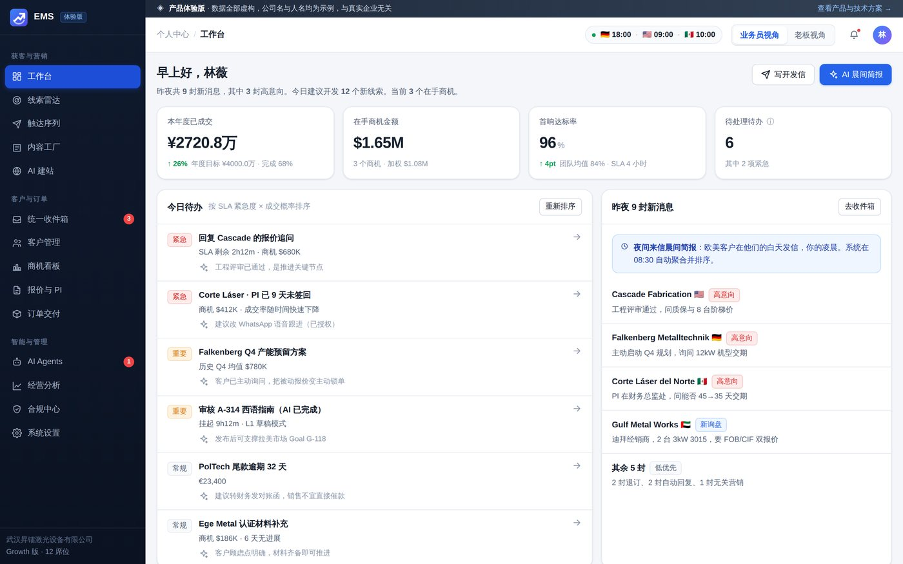
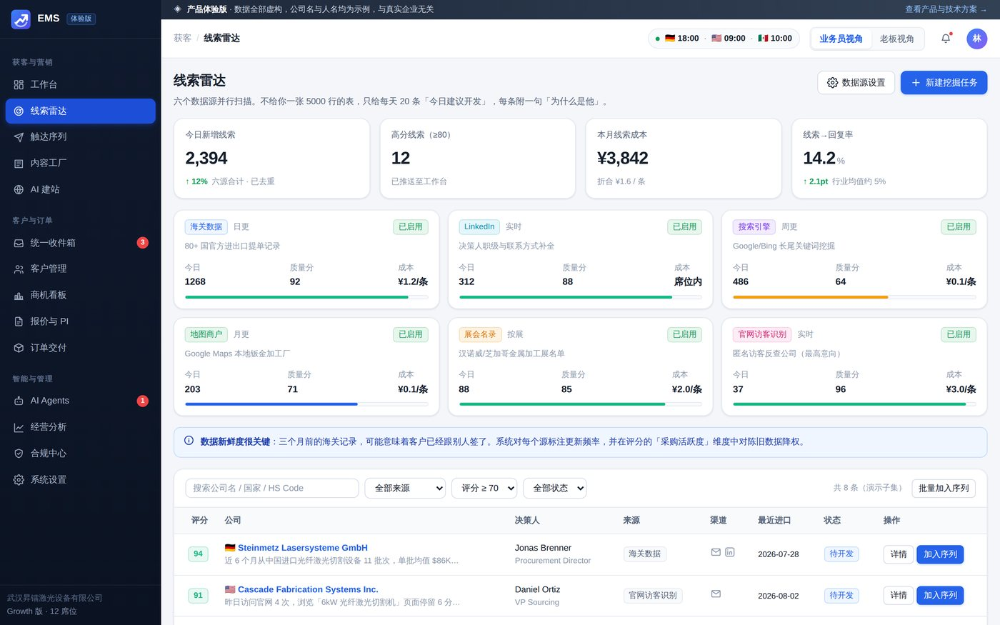
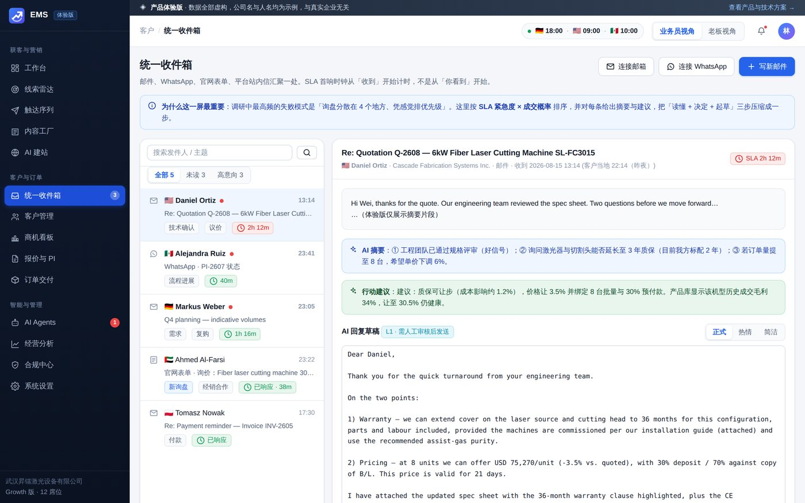
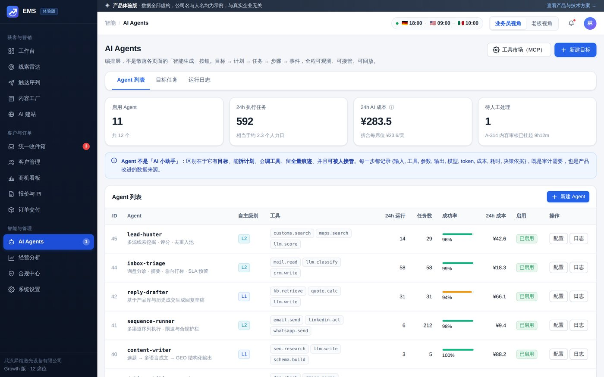
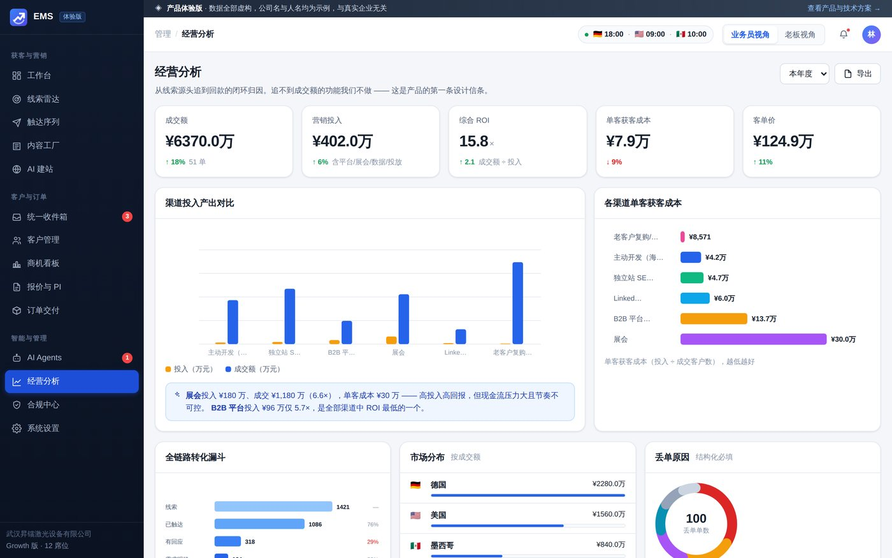

# EMS · 外贸营销系统

> AI Agent 驱动的外贸全链路增长系统 —— 从「找到买家」到「收到货款」跑在同一套数据上。

本仓库包含两部分：**产品与技术方案文档**，以及一个**可直接发布到 GitHub Pages 的纯前端体验版**。

---

## 一、文档

| 文档 | 内容 |
|---|---|
| [00 · 行业调研与业务流程](docs/00-行业调研与业务流程.md) | 2026 年市场的三个结构性变化、业务员与老板的真实工作、领域对象建模、竞品格局与我们的空位 |
| [01 · 产品方案](docs/01-产品方案.md) | 产品定位与信条、用户分层、八大模块详细设计、差异化护城河 |
| [02 · 技术方案](docs/02-技术方案.md) | 架构总原则、技术选型、系统架构图、数据模型、送达率/合规/Agent 三个关键子系统、非功能性要求与风险 |
| [03 · 路线图与商业化](docs/03-路线图与商业化.md) | M0–M4 路线图、定价结构、单位经济模型、GTM 策略、90 天行动清单 |

**一句话结论**：市面上没有一个产品同时做到 ① 主动获客 ② 全渠道合规触达 ③ 懂外贸的转化与交付 ④ 老板要的资产沉淀与渠道 ROI 归因 ⑤ 且以 AI Agent 编排而非「AI 插件」的方式重构工作流。这就是空位。

---

## 二、体验版

纯静态前端，**零依赖、零构建**。原生 ES Modules + 手写 SVG 图表，无 CDN、无外链资源，离线可用。

### 覆盖的 15 个界面

| 模块 | 界面 | 演示重点 |
|---|---|---|
| 工作台 | `#/dashboard` | **可切换业务员 / 老板双视角** —— 同一份数据，两套信息架构 |
| 获客 | `#/leads` | 六数据源并行、可解释的四维 AI 评分、来源快照 |
| 获客 | `#/sequences` | 多渠道序列编排、发信域健康度、合规拦截器 |
| 获客 | `#/content` | 选题雷达、内容流水线、GEO 结构化资产 |
| 获客 | `#/sites` | 母子站群、SEO/GEO 体检、AI 搜索引用监测 |
| 客户 | `#/inbox` | 邮件/WhatsApp/表单统一收件箱、AI 摘要与回复草稿 |
| 客户 | `#/customers` | 分层、公海/私海、客户资产沉淀率 |
| 客户 | `#/customers/C-1042` | 客户 360 时间线、opt-in 状态 |
| 客户 | `#/deals` | **可拖拽看板**，阶段推进需客观事件依据 |
| 客户 | `#/quotes` | 报价版本化、成本与汇率快照、PI 单据预览 |
| 交付 | `#/orders` | 节点甘特、单证清单、跨部门任务签收 |
| 智能 | `#/agents` | Agent 列表、目标任务编排、运行日志与回放 |
| 管理 | `#/analytics` | 渠道 ROI 归因、漏斗、丢单原因 |
| 管理 | `#/compliance` | opt-in 证据链、LIA 存档、退订中心、审计日志 |
| 管理 | `#/settings` | 集成、套餐用量、权限、客户资产规则 |

> ⚠️ 全部为**模拟数据**，仅用于演示产品形态与业务流程，不代表任何真实业绩。

### 界面截图

以下都是本地起服务跑当前代码、在 1440×900 下截的真实渲染结果。

**工作台** —— 业务员视角：今日待办按「SLA 紧急度 × 成交概率」排序，右边是夜间来信的 AI 晨间简报。右上角一键切老板视角，同一份数据换一套信息架构。



**线索雷达** —— 六个数据源并行跑，每条线索的四维 AI 评分都能点开看依据，不是一个说不清来历的分数。



**统一收件箱** —— 邮件、WhatsApp、表单进同一个盒子，AI 摘要给的是「工程团队已通过评审、问质保与 8 台阶梯价」这种可执行的事，不是一句「客户很感兴趣」。



**AI Agents** —— Agent 不是「AI 小助手」，是区分自主等级的编排对象：输入、工具、参数、模型、token、成本、决策依据，全部可观测。



**经营分析** —— 渠道 ROI 归因、全链路转化漏斗、丢单原因，回答的是老板那句「钱花在哪、哪条渠道值得加码」。



### 本地运行

因为使用 ES Modules，需要通过 HTTP 打开（不能直接双击 `index.html`）：

```bash
python3 -m http.server 8080
# 打开 http://localhost:8080
```

### 发布到 GitHub Pages

体验版使用**相对路径 + hash 路由**，因此放在任何子路径下都能正常工作。

**方案 A：`decli.github.io/ems`（当前线上采用）**

已部署在主页仓库 `decli/decli.github.io` 的 `ems/` 子目录下。

> ⚠️ **同步时只复制 `assets/`，不要覆盖 `ems/index.html`。**
> 线上那份 `ems/index.html` 由主页仓库维护，里面额外注入了站点级的
> Google Analytics 片段（与门户及 `/ftms/` 共用同一个 property）。
> 整个目录覆盖过去会把它抹掉，而且不会有任何报错提示。

```bash
git clone https://github.com/decli/decli.github.io.git
rsync -a --delete assets/ decli.github.io/ems/assets/     # 只同步 assets
cd decli.github.io && git add ems && git commit -m "sync EMS demo" && git push
```

若确实改动了本仓库的 `index.html`（改标题、meta 等），需要手工把改动**合并**进
线上那份，而不是整份替换 —— 否则 GA 片段会丢。

另一种做法是把本仓库直接改名为 `ems` 并开启 Pages，就不存在两份 `index.html`
需要同步的问题（Settings → General → Repository name）。

**方案 B：直接用当前仓库名发布**

Settings → Pages → Source 选择 `GitHub Actions`（仓库已含 `.github/workflows/pages.yml`），
或选择 `Deploy from a branch: main / (root)`。
访问地址为 `https://decli.github.io/exportmarketingsystem`。

`.nojekyll` 已包含，避免 Jekyll 处理 `assets/` 目录。

---

## 三、目录结构

```
├── index.html                 # 单页入口
├── .nojekyll                  # 关闭 GitHub Pages 的 Jekyll 处理
├── assets/
│   ├── css/app.css            # 设计 token + 全部样式
│   └── js/
│       ├── app.js             # 应用外壳、hash 路由、角色状态
│       ├── data.js            # 全部模拟数据（结构贴近技术方案的领域模型）
│       ├── ui.js              # 模板标签、内联 SVG 图标、通用组件
│       ├── charts.js          # 手写 SVG 图表（折线/柱状/漏斗/环形/雷达/甘特）
│       └── views/             # 15 个视图，各自返回 { html, mount }
└── docs/                      # 产品与技术方案
```

---

## 四、下一步

体验版的用途是**对内对齐产品认知、对外做客户访谈与融资演示**。

最重要的一件事写在 [03 文档](docs/03-路线图与商业化.md)结尾：
**先别写代码，先拿这个体验版去见 20 个人**（10 个业务员 + 10 个老板）。调研文档里的每条结论都来自公开资料，但你的客户是否也这么想，只有他们能告诉你。
